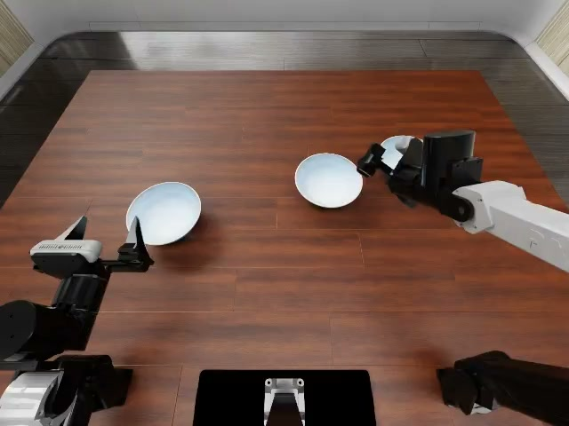
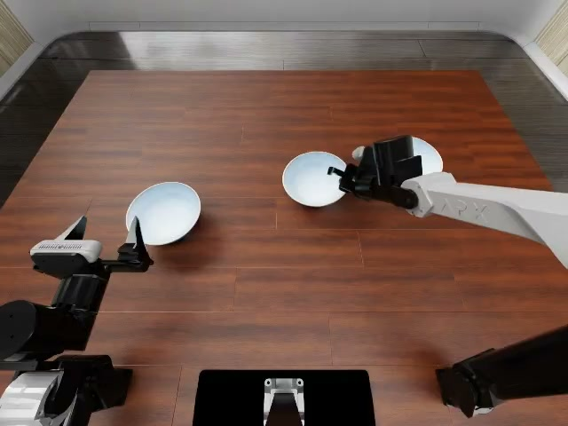
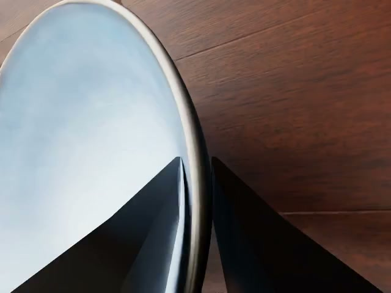
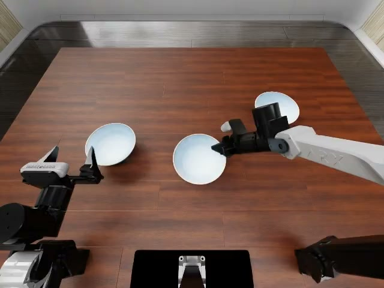
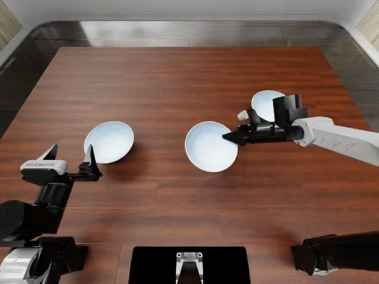
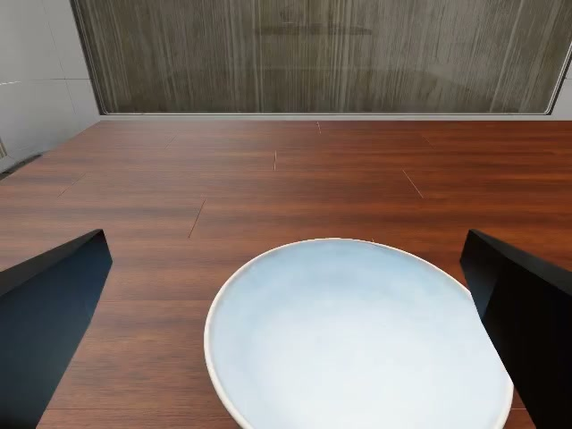
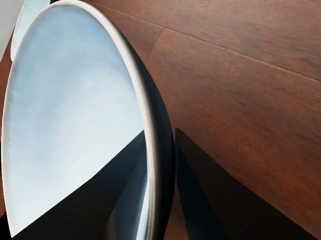
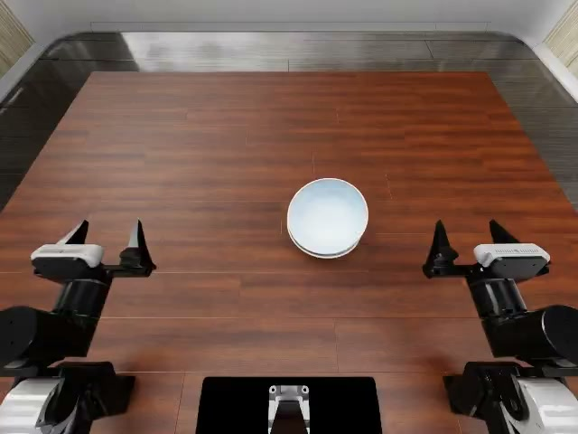

# Rendered experience: `stack_bowls`

> Review-only snapshot. The bridge does not read this file. In the actual App Server
> input, each image below is sent as a base64 data URL immediately after its label.

HISTORICAL SUCCESSFUL DEMONSTRATION  
Task name: stack_bowls  
Goal: Nest all three bowls upright, release them, then return to origin.  
Reference only: reuse stage order, arm roles, grasp orientation and gripper timing; adapt positions to the current images and measured state.  
State layout: left[x,y,z,qw,qx,qy,qz,gripper] + right[same]  
State is the measured keyframe state. Decision is the recorded command associated with that keyframe; it is historical evidence, not a pending command.

[EXAMPLE 1/5 | approach | frame 24]

Observed: right jaws open, closing in on the first upright bowl; left arm parked at home  
Roles: left=idle, right=active  
State: L xyz=[-0.2995,-0.3523,0.9215] q=[0.7070,-0.0000,-0.0000,0.7072] grip=open | R xyz=[0.2314,-0.1602,0.9653] q=[0.6154,-0.0597,0.4646,0.6339] grip=open  
Decision: L keep | R xyz=[0.2279,-0.1559,0.9632] q=[0.6210,-0.0705,0.4629,0.6286] grip=keep  
Outcome: aligned

Historical image 1: cam_high

[EXAMPLE 2/5 | grasp | frame 52]

Observed: right jaws just closed on the bowl rim, bowl tilted as it leaves the table  
Roles: left=idle, right=active  
State: L idle | R xyz=[0.1896,-0.1286,0.9182] q=[0.5651,-0.1351,0.4632,0.6692] grip=closed  
Decision: L keep | R xyz=[0.1892,-0.1294,0.9184] q=[0.5636,-0.1344,0.4624,0.6712] grip=keep  
Outcome: grasped

Historical image 2: cam_high

Historical image 2: cam_left_wrist

Historical image 2: cam_right_wrist

[EXAMPLE 3/5 | transport | frame 74]

Observed: right arm carrying the bowl left across the table toward the centre; left arm parked  
Roles: left=idle, right=active  
State: L idle | R xyz=[0.1821,-0.1766,0.9187] q=[0.2689,-0.2512,0.4120,0.8336] grip=closed  
Decision: L keep | R xyz=[0.1860,-0.1744,0.9161] q=[0.2647,-0.2465,0.4120,0.8363] grip=keep  
Outcome: transported

Historical image 3: cam_high

[EXAMPLE 4/5 | place | frame 103]

Observed: right arm has set the bowl down and its jaws are about to open; left arm parked  
Roles: left=idle, right=active  
State: L idle | R xyz=[0.2332,-0.1554,0.9245] q=[0.2540,-0.2010,0.4297,0.8429] grip=closed  
Decision: L keep | R xyz=[0.2339,-0.1528,0.9224] q=[0.2543,-0.2007,0.4335,0.8409] grip=keep  
Outcome: placed

Historical image 4: cam_high

Historical image 4: cam_left_wrist

Historical image 4: cam_right_wrist

[EXAMPLE 5/5 | home | frame 366]

Observed: both arms back at their home poses; the three bowls rest as one nested stack at the table centre  
Roles: left=active, right=idle  
State: L xyz=[-0.2995,-0.3522,0.9217] q=[0.7073,-0.0003,0.0000,0.7069] grip=open | R xyz=[0.3002,-0.3520,0.9232] q=[0.7045,-0.0037,0.0030,0.7097] grip=open  
Decision: L xyz=[-0.2995,-0.3522,0.9217] q=[0.7073,-0.0003,0.0000,0.7069] grip=keep | R keep  
Outcome: task_complete

Historical image 5: cam_high

END HISTORICAL DEMONSTRATION. Decide from the current observation below.
